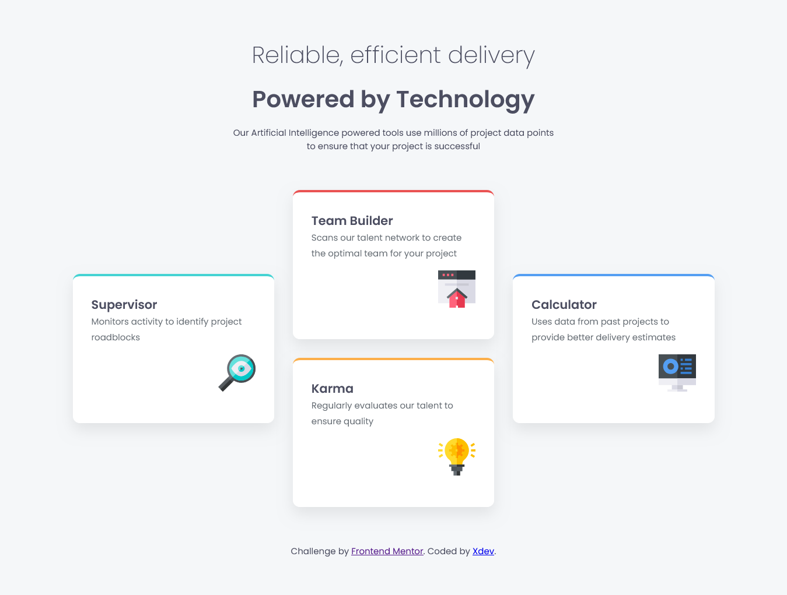

# Frontend Mentor - Four card feature section solution

This is a solution to the [Four card feature section challenge on Frontend Mentor](https://www.frontendmentor.io/challenges/four-card-feature-section-weK1eFYK). Frontend Mentor challenges help you improve your coding skills by building realistic projects. 

## Table of contents

  - [The challenge](#the-challenge)
  - [Screenshot](#screenshot)
  - [Links](#links)
- [My process](#my-process)
  - [Built with](#built-with)
  - [What I learned](#what-i-learned)
  - [Continued development](#continued-development)
  - [AI Collaboration](#ai-collaboration)
- [Author](#author)

### The challenge

Users should be able to:

- View the optimal layout for the site depending on their device's screen size

### Screenshot

### Links

- Solution URL: [solution]( https://github.com/Diser-Xian/Four-card-feature-section-solution)
- Live Site URL: [live site URL ](https://diser-xian.github.io/Four-card-feature-section-solution/)

## My process
- Analyze the the sample designs
- structure the html using semanthic elements
- style the website from top to bottom
- added an responsiveness
- refine the ui

### Built with
- Semantic HTML5 markup
- CSS custom properties
- Flexbox
- CSS Grid
- Mobile-first workflow

### What I learned
In this project I learned how to use CSS Grid to build structured layouts more efficiently. I practiced grid-template-columns with fractional units (fr) to control layout spacing.

Example I used:
.container {
  display: grid;
  grid-template-columns: repeat(4, 1fr);
}

I also learned how Flexbox can be used inside grid items to align content inside each card properly.

### Continued development
- Improve CSS Grid skills for advanced layouts
- Build better responsive designs without breaking structure
- Create cleaner reusable components
- Improve speed in planning layouts before coding

### AI Collaboration
I used ChatGPT to:
- Understand CSS Grid concepts like fr, repeat(), and layout behavior
- Debug layout issues
- Improve README structure

What worked well was faster understanding of layout concepts. What didn’t work well is that I still need practice to remember everything without assistance.

## Author

- Website - [My web app](https://animevault-ced.netlify.app/)
- Frontend Mentor - [@XDEV](https://www.frontendmentor.io/profile/XDEV)

